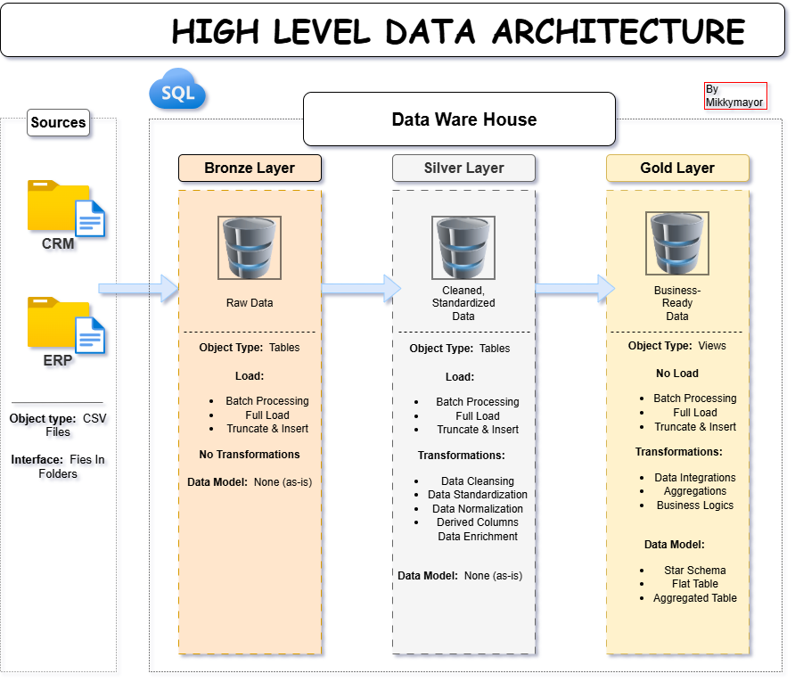
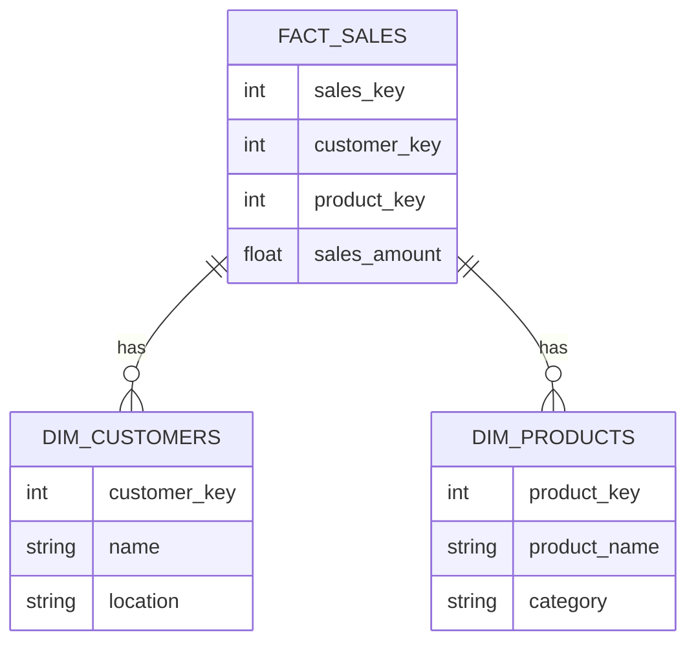

# 🚀 SQL Data Warehouse Project


-orange)


---

## 📌 Overview

This project demonstrates the end-to-end design and implementation of a modern **data warehouse** using SQL Server. It follows the **Medallion Architecture (Bronze → Silver → Gold)** to transform raw data into clean, structured, and analytics-ready datasets.

The solution simulates a real-world retail environment by integrating data from multiple source systems (**CRM & ERP**) and delivering a business-ready data model for reporting and insights.

---

## 🏗️ Architecture Diagram

‎

---

## 🗂️ Project Structure

```bash
SQL-DATAWAREHOUSE-PROJECT/
│
├── bronze/
│   ├── load_crm.sql
│   ├── load_erp.sql
│
├── silver/
│   ├── clean_customers.sql
│   ├── clean_products.sql
│
├── gold/
│   ├── dim_customers.sql
│   ├── dim_products.sql
│   ├── fact_sales.sql
│
├── tests/
│   ├── test_queries.sql
│
├── docs/
│   ├── architecture.png
│   ├── data_model.png
│
└── README.md
```

---

## 🧱 Data Model (Star Schema)



---

## 📊 Sample Results

### 🔹 Top Sales Records


> Replace with your actual screenshot after running queries.

---

## 📊 Sample Queries

```sql
SELECT TOP 10 *
FROM gold.fact_sales;

SELECT customer_key, SUM(sales_amount) AS total_sales
FROM gold.fact_sales
GROUP BY customer_key;
```

---

## ⚙️ How to Run This Project

1. Clone the repository:

```bash
git clone https://github.com/your-username/SQL-DATAWAREHOUSE-PROJECT.git
```

2. Load raw datasets into SQL Server

3. Execute scripts in order:

* Bronze
* Silver
* Gold

4. Run test queries from `/tests`

---

## 🚧 Challenges & Solutions

**Inconsistent Data Formats**
Standardized during Silver layer

**Missing Values**
Handled with default values and cleaning logic

**Data Integration**
Unified keys across CRM and ERP

---

## 🔮 Future Improvements

* Power BI dashboard integration
* Incremental loading (CDC)
* Airflow orchestration
* Data quality checks automation

---

## 👤 Author

**Michael Adamu Egietsemeh**
Data Analyst | Aspiring Data Engineer

---

## ⭐ If you like this project

Give it a ⭐ on GitHub and share feedback!
