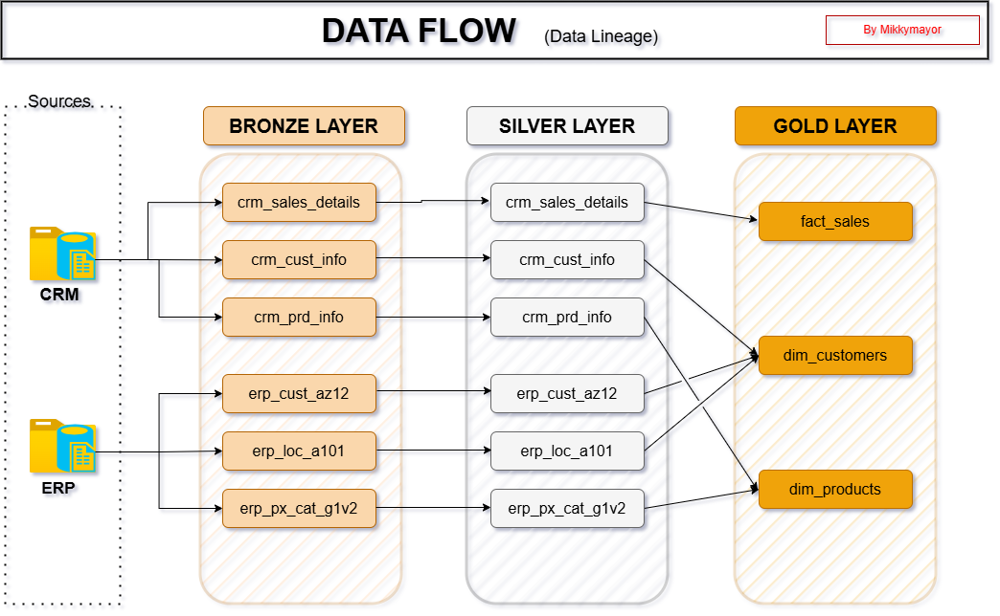
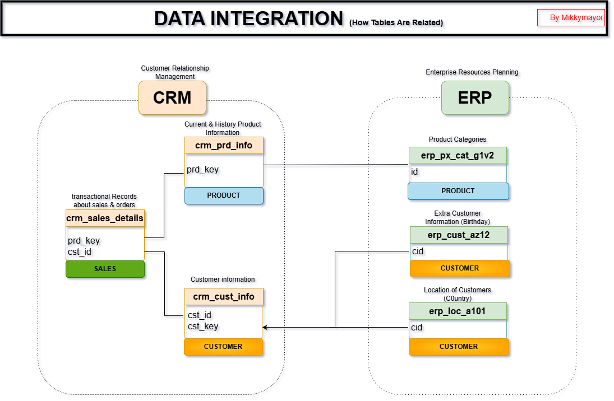
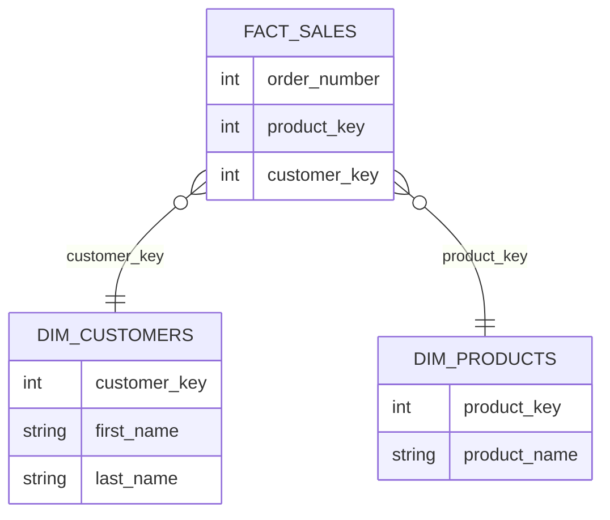

# 📊 SQL Data Warehouse Project

## 🚀 Overview
This project demonstrates the design and implementation of an end-to-end data warehouse solution using SQL. It follows the Medallion Architecture (Bronze → Silver → Gold) to transform raw data into clean, structured, and business-ready data for analytics.

The project showcases key data engineering concepts including data ingestion, transformation, data modeling, data quality validation, and documentation.

---

## 🏗️ Architecture
The data warehouse is structured using the Medallion Architecture:

- **Bronze Layer**  
  Raw data ingested directly from source systems with minimal transformation.

- **Silver Layer**  
  Cleaned, standardized, and validated data to ensure consistency and quality.

- **Gold Layer**  
  Business-ready data models optimized for analytics and reporting.

---

## 📊 Data Architecture Diagram

---

## 🔄 Data Flow

---

## 🗃️ Data Integration 

---

## 📂 Project Structure

SQL-DATAWAREHOUSE-PROJECT

├── datasets/        # Raw datasets used for the project  
├── scripts/         # SQL scripts for transformations (bronze → silver → gold)  
├── tests/           # Data quality checks and validation queries  
├── docs/            # Documentation (data catalog, diagrams)  
├── README.md        # Project overview  
└── LICENSE  

---

## ⭐ Data Model (Star Schema)

The Gold layer is designed using a star schema to support analytical queries efficiently.

- **Fact Table**
  - `gold.fact_sales` → Stores transactional sales data

- **Dimension Tables**
  - `gold.dim_customers` → Customer information  
  - `gold.dim_products` → Product details  

### Star Schema Diagram

[Sales Mart Data: Star schema](docs/diagrams/sales_mart.drawio.png)

## 📘 Data Catalog

A detailed data catalog has been created to document all tables and columns in the Gold layer.

[Location:](docs/data_catalogue.md)

The data catalog includes:
- Column names  
- Data types  
- Business definitions  
- Table-level descriptions  

This ensures clarity, consistency, and usability for both technical and non-technical stakeholders.

---

## ✅ Data Quality Checks

To ensure data reliability and integrity, a set of data quality validation checks has been implemented.

These checks include:

- **Duplicate Checks**  
  Ensuring no duplicate records exist in primary or business keys.

- **Null Value Checks**  
  Validating that critical fields (e.g., customer_key, product_key) do not contain NULL values.

- **Referential Integrity Checks**  
  Ensuring all foreign keys in the fact table correctly map to dimension tables.

- **Data Standardization Checks**  
  Validating cleaned values such as gender, country, and product categories.

[Location for gold test:](tests/quality_tests_gold.sql)
[Location for silver test:](tests/quality_test_silver.sql)

---

## 💼 Business Use Case

This project simulates a retail data warehouse designed to support business intelligence and analytics.

It enables organizations to:

- Analyze customer demographics and behavior  
- Track product performance across categories  
- Monitor sales trends over time  
- Improve decision-making through structured data  

The Gold layer provides a clean and reliable foundation for reporting tools and dashboards.

---

## 🛠️ Tools & Technologies

The following tools and technologies were used:

- **SQL (T-SQL)** → Data transformation and modeling  
- **Microsoft SQL Server** → Database management system  
- **Git & GitHub** → Version control and project documentation  

---

## 📈 Key Features

- End-to-end data warehouse implementation  
- Medallion architecture (Bronze, Silver, Gold layers)  
- Dimensional modeling using star schema  
- Data quality validation framework  
- Structured and documented data catalog  

---

## 🎯 What This Project Demonstrates

This project demonstrates my ability to:

- Design and implement scalable data warehouse architectures  
- Transform raw data into business-ready datasets  
- Apply best practices in data modeling (fact & dimension tables)  
- Write efficient, clean, and maintainable SQL queries  
- Ensure data quality and consistency  
- Document data systems effectively  

---

## 🔮 Future Improvements

Planned enhancements for this project include:

- Integration with BI tools (Power BI or Tableau) for visualization  
- Implementation of incremental data loading strategies  
- Pipeline orchestration using tools like Apache Airflow  
- Automation of data quality monitoring  
- Performance optimization for large-scale datasets  

---

## 👤 Author

**Michael Adamu Egietsemeh**  
Data Analyst transitioning into Data Engineering with hands-on experience building SQL-based data warehouses using Medallion Architecture  

---

## ⭐ Notes

This project is part of my data engineering learning journey and reflects practical implementation of modern data warehouse design principles.
